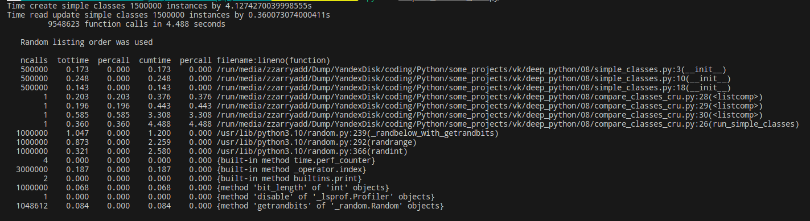

# Результаты

## 1. Сравнение использования weakref и слотов

### Запуск

```py
python compare_classes_cru.py
```

### Прогон классов с обычными атрибутами:

Время создания классов с обычными атрибутами в размере 1500000 объектов составляет 4.1274270039998555 сек.

Время чтения/обновления атрибутов класса с обычными атрибутами в размере 1500000 объектов составляет 0.360073074000411 сек.



### Прогон классов со слотами:

Время создания классов со слотами в размере 1500000 объектов составляет 3.5146337989999665 сек.

Время чтения/обновления атрибутов класса со слотами в размере 1500000 объектов составляет 0.30897875500022565 сек.


### Прогон классов со слабыми ссылками:

Время создания классов со слабыми ссылками в размере 1500000 объектов составляет 4.51628472099992 сек.

Время чтения/обновления атрибутов класса со слабыми ссылками в размере 1500000 объектов составляет 0.37483583600032944 сек.


## 2. Профилирование

### Запуск

```py
python -m memory_profiler compare_classes_memory.py
```

### Прогон классов с обычными атрибутами:


### Прогон классов со слотами:


### Прогон классов со слабыми ссылками:

