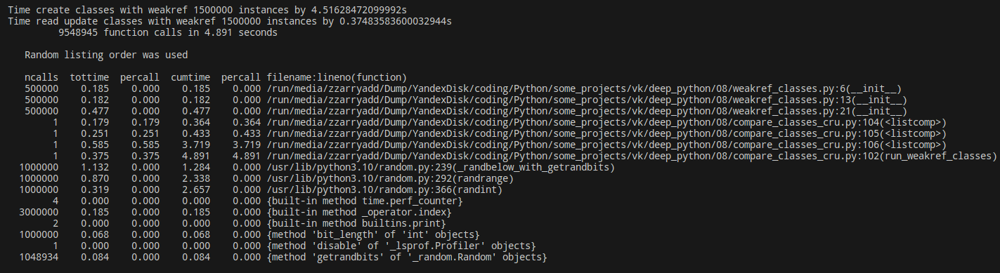

# Результаты

## 1. Сравнение использования weakref и слотов

### Запуск

```py
python compare_classes_cru.py
```

### Прогон классов с обычными атрибутами:


### Прогон классов со слотами:


### Прогон классов со слабыми ссылками:



## 2. Профилирование

### Запуск

```py
python -m memory_profiler compare_classes_memory.py
```

### Прогон классов с обычными атрибутами:


### Прогон классов со слотами:


### Прогон классов со слабыми ссылками:

